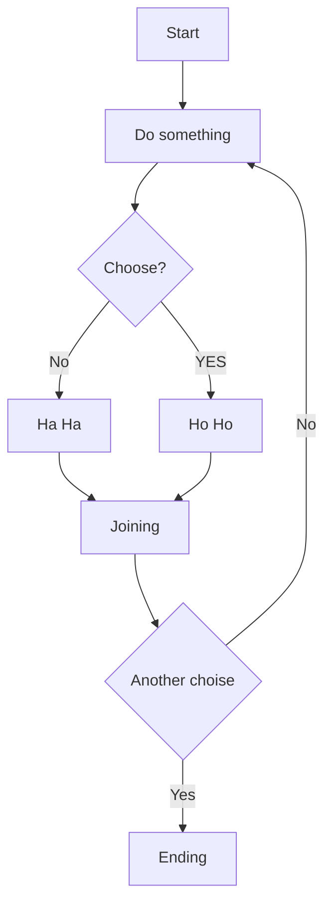

# PyPlate

<!-- START doctoc generated TOC please keep comment here to allow auto update -->
<!-- DON'T EDIT THIS SECTION, INSTEAD RE-RUN doctoc TO UPDATE -->

  - [About](#about)
  - [Features](#features)
  - [Requirements](#requirements)
    - [Runtime](#runtime)
    - [Development](#development)
  - [Install](#install)
    - [Download](#download)
    - [Installation](#installation)
  - [Freqlenty asked Questions](#freqlenty-asked-questions)
  - [Links](#links)
  - [Contribute](#contribute)
  - [License](#license)
  - [Some examples, remove after creation](#some-examples-remove-after-creation)
- [The largest heading](#the-largest-heading)
  - [The second largest heading](#the-second-largest-heading)
          - [The smallest heading](#the-smallest-heading)
  - [Tables](#tables)
  - [List](#list)
  - [Task list](#task-list)
  - [Colapsed section](#colapsed-section)
      - [We can hide anything, even code!](#we-can-hide-anything-even-code)
  - [Links](#links-1)

<!-- END doctoc generated TOC please keep comment here to allow auto update -->

## About

## Features

## Requirements

### Runtime

### Development

## Install

### Download

### Installation

### Configuration

## Freqlenty asked Questions

## History

[HISTORY.md](/HISTORY.md)

## ToDo
- Class generation
- Custom header
- Project mgt

## Links

- [Python GTK+ 3 Tutorial](https://python-gtk-3-tutorial.readthedocs.io/en/latest/index.html)

## Contribute

**Author:** Peter Malmberg <peter.malmberg@gmail.com>

## License 

MIT

